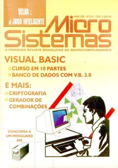

# About me

I'm Lucio Paiva, a software developer with a Computer Science Master's degree from Federal University of Rio de Janeiro. I currently live in Rio with my wife Priscila and work at [Zwift][zwift], a very cool indoor cycling online game.

## Short bio

 Programming computers is my life's passion. I taught myself how to program by the age of 13 by reading a programming tutorial that came in an Electronics magazine called Microsistemas my father subscribed to. I started with Visual Studio 3, then I went to BASIC, Pascal and Delphi.

Then I went reverse engineering other programs and eventually started to crack applications just for fun. I learned Intel assembly language, played a lot with making my own experimental viruses and even wrote some Windows programs in pure assembly using MASM. [Iczelion's page][iczelion] was a fantastic resource at the time and it is still online as I write this! Just amazing.

I went to CEFET in 1998, a technical school in the Rio area where [my father][aridio] still teaches electronics as of today, where I took a technical-grade course on computers. That's where I started to mess with computer networking together with my friend Guilherme, playing a lot with BackOrifice, Netbus, Cain and other tools that were popular at that time. Then I started making my own "remote administration" tools. It taught me a lot about network connections, how network layers are designed and how operating systems deal with it.

Fast-forward a few years, in 2003 I joined [UFRJ][ufrj]. It's a federal university, so you have to pass a test to enter it. I was probably the only candidate that knew the results before the public announcement was made. How I did that? Passwords were automatically generated for each candidate and you couldn't even change it. So I managed to unveil the password generation algorithm and that allowed me to access every candidate's account. OK, the only thing I could do was to check the candidate's grades. But that was sufficient for me to make a little tool called *Minerva Cracker* to automatically crawl into each and every candidates' accounts and download their grades data to my own local database, so I could rank them by grade myself.

I could then verify that I was #15 in the Computer Science ranking, meaning I passed :-) The password was composed of 10 numeric digits, but I had only figured out the first 9. That meant *Minvera Cracker* had to try up to 10 passwords for each candidate. I ended up running 10 sockets in parallel, each querying for one combination and then joining on a barrier that recorded the only one that succeeded. One year later I was able (with the help of my friend André Luiz) to crack the last digit, which was made of a series of modulus operations on the other digits.

It was also André that presented me to the best game I played so far: [Ultima Online][ultima-online]. I played it for some time as a normal person would do, but then I discovered the real fun with it: automate my character to behave like it had a real intelligence behind it all the time. It would gather resources, move around the virtual world, buy and sell stuff, all unattended. I wrote several scripts for EasyUO, [some of them published][easyuo], and I also started making my own macroing tool, *LlamaScript*. Although I never finished it, I learned a lot as I hacked into UO. *LlamaScript* scanned UO client's program memory, looking for certain assembly instructions, changing them at runtime and injecting code that would detour the game's logic to run my macroing tool's routines prior to running actual game code at each game loop iteration. Some years later I even started making my own experimental game client using Node.js and Chromium (before I knew about Electron).

Speaking of games, as a child my favorite game by far was [Rome: AD 92][rome]. It was circa 2005 when I remembered of its existence after I bumped into it again, stored in a backup CD I had. I played it a bit and then thought about writing to the original developer to thank him. To my surprise, not only [Steve Grand][steve-grand] replied to my email, he also gave me Rome's source code! Steve told me mine was probably the first email he got from a Rome fan, since everybody seems to know him for his other game, *Creatures*.

Fast-forward to 2009, I was finishing my graduation and my final project was an electronic chromatic guitar tuner, a hardware device having a PIC micro-controller at its core which was responsible for detecting the periodicity of an input signal to translate it to the 12-tone equal temperament scale, showing how many cents the input tone was off using as reference the closest known note. It was my first attempt at playing with sound. Although it only worked for instruments whose fundamental frequency was the prevalent one, it worked pretty well.

A few years later, in 2012, I was finishing my Master's degree and my final thesis' theme was traffic coordination and control. And I mean traffic as in vehicles, not network packets :-) It was one of my earliest desires as a programmer to be capable of making a vehicle simulation system. My academic advisor, Felipe França, presented me with an algorithm he devised to solve the [dining philosopher's problem][dining-philosophers] with nonuniform priorities. The algorithm, known as [Scheduling By Multiple Edge Reversal][smer-paper], was applied by me to control the phases of a traffic signal according to incoming traffic, as well as to coordinate traffic corridors with several signals and guarantee maximum road efficiency by creating so-called green corridors and by optimizing average speed and travel time. The simulator was made of two parts: one console app made in Java and a separate Java applet app that showed the simulation happening. I still want to revisit this project at some point and make a web application version of it.

During the period between 2011 and 2014 I co-founded a startup with some friends and most of the time there I worked R&D'ing. Our first product was a groceries' price comparison mobile app called *BoaLista*. My first interesting project at *BoaLista* was an information retrieval system to match and group products from different online stores that had no barcode information, so we could properly compare product prices and feed our product price base. So I designed my own algorithm for it and it worked like a charm. I had to take into account things like different product sizes, weights, flavors, typos, lack of standards when defining product names and descriptions, etc... it was really challenging.

I'm a big fan of music (who isn't?). I can play the guitar (badly), but what I really like is to think about what makes sound be interpreted as music to our ears, why some frequencies go well with others while some don't, etc. I like reverse engineering sound in general and experimenting with it. During my professional endeavour at *BoaLista*, the second interesting project I had the chance to design was my own sound transmission protocol, together with a hardware ultrasound emitter and a mobile app receiver running a native library to interpret the signal emitted.

<!-- continuar aqui -->
<!-- insert caixinha photo -->

I like to discuss religion to try to understand why people believe in things (me included). I don't believe in gods of any sorts, although I try to keep my mind open to new ideas. The thing is, there is no point in believing in a thing that you won't be able to interact with in an observable manner. I was born in a catholic family, so I was raised to believe in god. But then came my teenage years and I started to reject every concept that was put before me. As I started to reject the idea of a god, I saw that it wasn't doing me any harm. There was no thunder coming from the skies to strike me, no divine wrath of any kind. So I found out I didn't need to be fearful of god. I could even curse this supposed entity and nothing would happen. I made my own experiments and came to the conclusion that I was fine with not believing in anything, that it wouldn't make my life more miserable I think that life sucks, but don't take me wrong. I find my life to be amazing and I consider myself to be a very lucky guy. I have nothing to complain about my life exactly, but I do like to complain about life in general. I like people around me and I also consider myself to be very lucky to have met so many awesome people along the way, but I tend to hate humankind as a whole.

I don't like this whole idea of human-made global warming, but I also have to be cautious to talk about it because everybody is so religious about it and I don't want people to get me wrong. I do think that there is something wrong about all this trend in which people started to believe, all out of the sudden, in Earth computer models that are probably totally wrong. People are stupid and their models will very likely be stupid as well. The problem is, climate deniers also happen to be the scum of mankind. They believe in non-renewable energy sources, they want to build walls and they are probably disguised nazis. That's where my problem lives. It's difficult to find someone that doesn't believe in human-made global warming which isn't a complete fuck. I'm not sure about human-made global warming, but I also think that renewable energies are an awesome thing. I really like the idea of self-sustainability and renewable energies are the only way mankind can continue for the long term.

Religion also brings the subject of life itself.

[zwift]: https://www.zwift.com
[iczelion]: https://win32assembly.programminghorizon.com/tutorials.html
[aridio]: http://www.aridio.com
[ufrj]: https://en.wikipedia.org/wiki/Federal_University_of_Rio_de_Janeiro
[ultima-online]: https://en.wikipedia.org/wiki/Ultima_Online
[easyuo]: http://www.easyuo.com/psl.php?page=mypsl&scripter=cannedboot
[rome]: https://en.wikipedia.org/wiki/Rome:_Pathway_to_Power
[steve-grand]: https://en.wikipedia.org/wiki/Steve_Grand_(roboticist)
[dining-philosophers]: https://en.wikipedia.org/wiki/Dining_philosophers_problem
[smer-paper]: http://www.cos.ufrj.br/~felipe/recentpapers/es41296.ps
