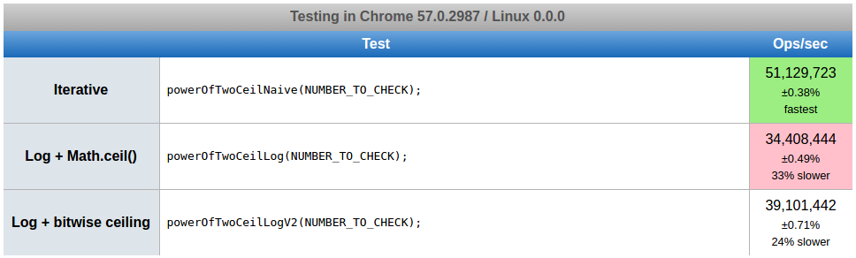
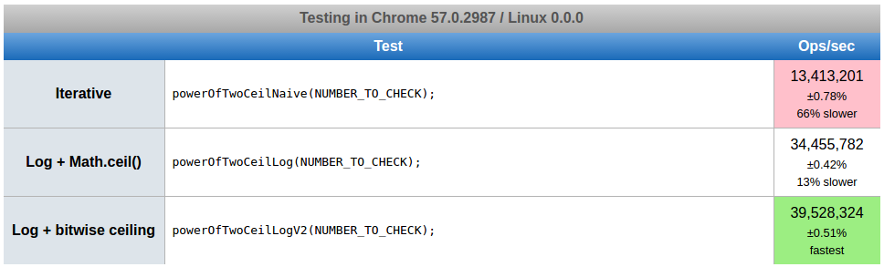

# How to find the next power of two

Quick one: given a number, how to find the power of two that immediately follows it?

One first, naive approach would be to iterate through all powers of two until you find the first one greater than the number being queried for:

    function powerOfTwoCeilNaive(value) {
        let powerOfTwo = 1;
        while (powerOfTwo < value) {
            powerOfTwo <<= 1;
        }
        return powerOfTwo;
    }

But then we could also calculate it using Math.log2():

    function powerOfTwoCeilLog(value) {
        return 1 << Math.ceil(Math.log2(value));
    }

This avoids having to loop through all power of twos. But is it actually faster? Before we find out which one is more efficient, let's add one more test. It's basically the same as the log test, but it replaces `Math.ceil()` with a bitwise operation, a ternary comparison and possibly an addition:

    function powerOfTwoCeilLogV2(value) {
        const log2 = Math.log2(value);
        const log2Trunc = ~~log2;
        return 1 << (log2 === log2Trunc ? log2Trunc : log2Trunc + 1);
    }

*Note: in case `~~` looks cryptic to you, it is an old Javascript trick to truncate float values. `~` is just a bitwise not. The trick is that every time you run a bitwise operation on a number, Javascript automatically converts it to an integer value, truncating it. So you just need to negate it twice to get the original value floored.*

Now let's run a jsperf test on it and see the results. Here are the results for `value` set to 31:

And if we take the value to 1023:

Now let's see what happens when we make `value` a thousand times bigger (`(1 << 20) - 1`):

The naive approach starts winning, but take a look at the number of iterations as `value` grows. Naive runs 51 million calculations if value is low, but goes down to 13 million as value becomes bigger. Not surprisingly, as the number of log operations doesn't change according to value, log runs execute the same number of times across tests. We say that the log approach scales while the naive approach doesn't. It makes sense, since it has to iterate through all power of twos while the log functions only have to calculate one single log.

It's also interesting to see that `Math.ceil()` does not perform as well as the bitwise operator. We could very well overwrite `Math.ceil()` with our own implementation and it would instantly perform 13% faster than the one shipping with Chrome.

So, the conclusion is: log wins over iteration. Of course, bear in mind you should only go with the bitwise approach if you really need to take performance into account, i.e., if you're having to calculate it thousands of times for different values. Otherwise, keep it simple and use the `Math.ceil()` approach which is already good enough. Interestingly, if you're calculating power of twos of *small values* (up to approximately 2^5) several times, the naive approach is the one to use!

And here's the [jsperf test](https://jsperf.com/power-of-two-ceiling) in case you wanna play with it.
