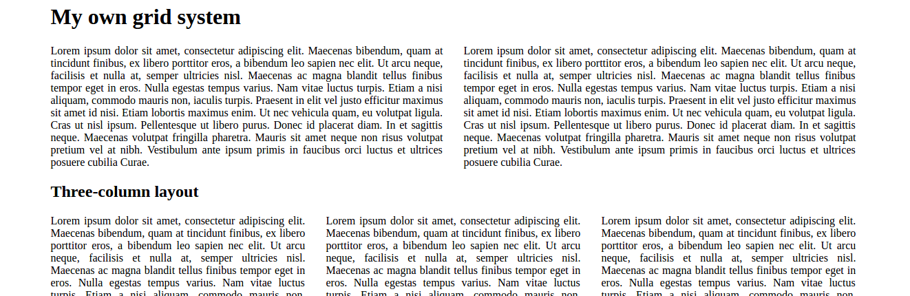
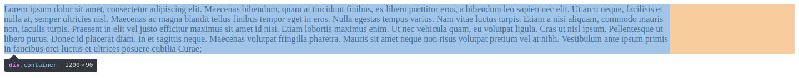
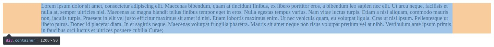
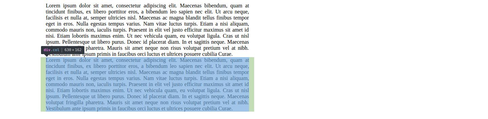
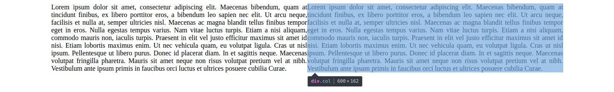
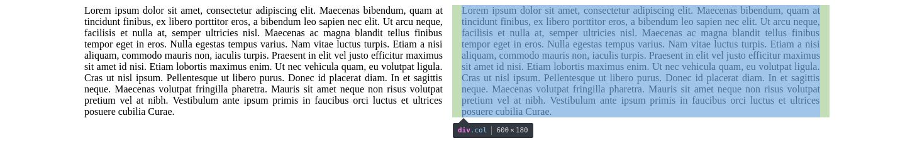
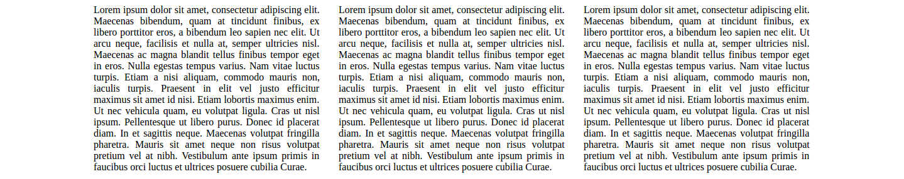
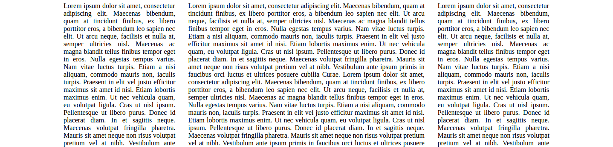
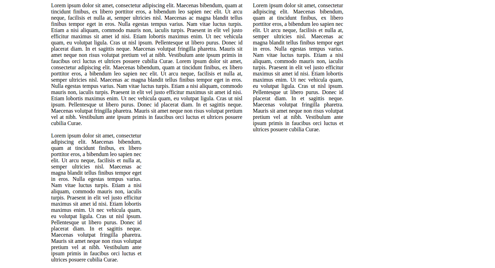
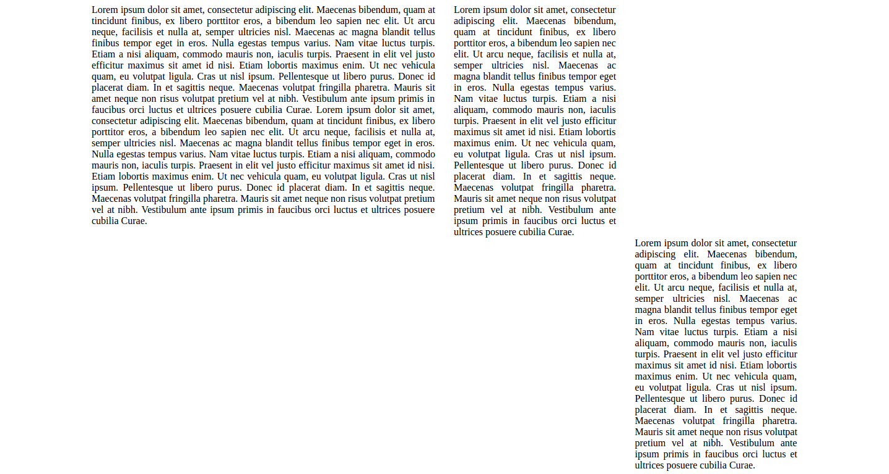

# Make Your Own Bootstrap-like Grid System

June 25th, 2017

Ever wondered how Bootstrap works to compose your page with rows and columns that fit so perfectly? This tutorial aims at demystifying how a grid system like Bootstrap works. After reading this article you'll be able to make your own, simple CSS script to reproduce with little effort what Bootstrap does to structure your page layout.

This is what we will have in the end

[Bootstrap](http://getbootstrap.com) is what is popularly called a *grid system*. It was not the first one, but since its appearance circa 2012 it has been the dominant grid system used world-wide. Grid systems come to improve page layout construction, what in the past was usually done using table elements. Since the "*tableless* revolution", however, grid systems became increasingly popular and completely replaced the use of tables, which now most serious developers deem conceptually ugly and amateurish.

## A single column

So let's see how to start creating our own grid system. We'll begin with a simple, one-column layout page. The first thing grid systems usually do is define a fixed width for the page. In the dawn of the grid system era (circa 2008), most computer monitors had a width resolution of up to 1024 pixels, so the first grid systems (e.g., [960.gs](http://960.gs)) were constrained by that. Today, Bootstrap 3 defines its maximum width as 1200 px wide, so let's start with that. Create a simple `index.html` file that links to a `index.css` file:

    <!DOCTYPE html>
    <html lang="en">
    <head>
        <meta charset="UTF-8">
        <title>Grid system</title>
        <link rel="stylesheet" href="index.css">
    </head>
    <body>
    </body>
    </html>

Now start playing with `index.css` by adding a class called `container` which will define our page width:

    .container {
        width: 1200px;
    }

Also add a simple `container` div to our page body with some lorem ipsum text:

    

        Lorem ipsum dolor sit amet, consectetur adipiscing elit. Maecenas bibendum, quam at tincidunt finibus, ex libero porttitor eros, a bibendum leo sapien nec elit. Ut arcu neque, facilisis et nulla at, semper ultricies nisl. Maecenas ac magna blandit tellus finibus tempor eget in eros. Nulla egestas tempus varius. Nam vitae luctus turpis. Etiam a nisi aliquam, commodo mauris non, iaculis turpis. Praesent in elit vel justo efficitur maximus sit amet id nisi. Etiam lobortis maximus enim. Ut nec vehicula quam, eu volutpat ligula. Cras ut nisl ipsum. Pellentesque ut libero purus. Donec id placerat diam. In et sagittis neque. Maecenas volutpat fringilla pharetra. Mauris sit amet neque non risus volutpat pretium vel at nibh. Vestibulum ante ipsum primis in faucibus orci luctus et ultrices posuere cubilia Curae.
    

Now load the page in a browser to see the result:

We have a div with width of 1200 px, but it is aligned to the left. Bootstrap pages are usually center-aligned in the browser. The proper way to center-align a div in CSS is to add auto margins to it:

    .container {
        width: 1200px;
        margin-left: auto;
        margin-right: auto;
    }

Now the page is properly centered:

## Two-column layout

To start playing with columns, we can define an equal-sized, simple two-column layout. Ideally, we would like each column to be a div element, so let's define a class for it:

    .col {
        width: 50%;

        text-align: justify;
    }

Width is set to be exactly half of its container's. I also justified text within it so it'll be easier to see where the padding of each column is during the tutorial, but keep in mind this is just for debugging purposes and it doesn't need to be part of the final grid system. In the HTML we will add two divs referencing the new class:

    

        

            Lorem ipsum dolor sit amet, consectetur adipiscing elit. Maecenas bibendum, quam at tincidunt finibus, ex libero porttitor eros, a bibendum leo sapien nec elit. Ut arcu neque, facilisis et nulla at, semper ultricies nisl. Maecenas ac magna blandit tellus finibus tempor eget in eros. Nulla egestas tempus varius. Nam vitae luctus turpis. Etiam a nisi aliquam, commodo mauris non, iaculis turpis. Praesent in elit vel justo efficitur maximus sit amet id nisi. Etiam lobortis maximus enim. Ut nec vehicula quam, eu volutpat ligula. Cras ut nisl ipsum. Pellentesque ut libero purus. Donec id placerat diam. In et sagittis neque. Maecenas volutpat fringilla pharetra. Mauris sit amet neque non risus volutpat pretium vel at nibh. Vestibulum ante ipsum primis in faucibus orci luctus et ultrices posuere cubilia Curae.
        

        

            Lorem ipsum dolor sit amet, consectetur adipiscing elit. Maecenas bibendum, quam at tincidunt finibus, ex libero porttitor eros, a bibendum leo sapien nec elit. Ut arcu neque, facilisis et nulla at, semper ultricies nisl. Maecenas ac magna blandit tellus finibus tempor eget in eros. Nulla egestas tempus varius. Nam vitae luctus turpis. Etiam a nisi aliquam, commodo mauris non, iaculis turpis. Praesent in elit vel justo efficitur maximus sit amet id nisi. Etiam lobortis maximus enim. Ut nec vehicula quam, eu volutpat ligula. Cras ut nisl ipsum. Pellentesque ut libero purus. Donec id placerat diam. In et sagittis neque. Maecenas volutpat fringilla pharetra. Mauris sit amet neque non risus volutpat pretium vel at nibh. Vestibulum ante ipsum primis in faucibus orci luctus et ultrices posuere cubilia Curae.
        

    

Here's the result:

The columns actually appear stacked (the second column is highlighted in the screenshot so it can be identified); not exactly what one would expect. To fix that, we need to make divs float to the left:

    .col {
        width: 50%;
        float: left;

        text-align: justify;
    }

And that's our first working column layout. Columns look like they need some padding, though; they are too close to each other.

## Column padding

Bootstrap adds a 30-pixel space between each pair of columns, so let's do the same with our layout:

    .col {
        width: 50%;
        float: left;
        padding-left: 15px;
        padding-right: 15px;

        text-align: justify;
    }

By adding 15 pixels to each side of each column, adjacent columns will total a 30px-width gutter between them. The result is frustrating, though:

The reason columns are stacked again is because they were already occupying 100% of the available width (50% + 50%), but now we added 60 more pixels to it (15px + first column + 15px + 15px + second column + 15px). As the combined width does not fit the container width, the second column breaks into a second row.

The trick to solve this issue involves a property called `box-sizing`. It tells the browser how borders, margins and padding should be taken into account when calculating an element's width and height. The default value, `content-box`, tells the browser to keep 'em **out** of the element dimensions. That's why our row is breaking into two. We want to change the default behavior by setting `box-sizing` to `border-box`, which brings borders and padding inside the element when calculating the final width, the only thing left out being the margins. Matter of fact, we want that to be the default behavior for all elements from now on:

    * {
        box-sizing: border-box;
    }

And now we have some beautiful two-column layout:

## Three-column layout

Adding more columns is trivial. For three columns, for example, all we have to do is adjust `col`'s width to span one third of its container width:

    .col {
        width: 33.333333%;  /* one third of the container */
        float: left;
        padding-left: 15px;
        padding-right: 15px;

        text-align: justify;
    }

Remember to add a third div to the HTML script:

    

        

            Lorem ipsum...
        

        

            Lorem ipsum...
        

        

            Lorem ipsum...
        

    

The result:

## Twelve-column layout

You may ask: why grid systems like the number 12 so much? Why not a "five-column layout"? The answer lies in the flexibility it gives to the web developer with respect to width division. Here are some possibilities:

* two equal-sized columns (6, 6)
* three equal-sized columns (4, 4, 4)
* one side bar, one main column (3, 9)
* two lateral columns, a larger one in the center (3, 6, 3)

Being divisible by 3 and 4, twelve-column layout comprises all most common column arrangements.

So far we've been using a single CSS class, `col`. In order to have a full blown twelve-column layout, however, we'll need more classes. Let's define a unit width as being 1/12th of the container screen and store it in a CSS variable we'll name `--unit-width`:

    :root {
        --unit-width: calc(100% / 12);
    }

The previous `col` class will now be forked into twelve different classes, one for each possible column width. All of them, however, will still have the same base properties. As CSS still doesn't allow for subclassing, we'll do a little trick to achieve the same effect. Let us name all of our column types with the same prefix `col-` so we can add the following rule:

    .container [class^="col-"] {
        float: left;
        padding-left: 15px;
        padding-right: 15px;

        text-align: justify;
    }

This rule will apply to any element classed as *`col-`something* living inside a container. Next we can finally define all our column types as one-liners, like this:

    .col-1 { width: calc(var(--unit-width) * 1); }
    .col-2 { width: calc(var(--unit-width) * 2); }
    .col-3 { width: calc(var(--unit-width) * 3); }
    .col-4 { width: calc(var(--unit-width) * 4); }
    .col-5 { width: calc(var(--unit-width) * 5); }
    .col-6 { width: calc(var(--unit-width) * 6); }
    .col-7 { width: calc(var(--unit-width) * 7); }
    .col-8 { width: calc(var(--unit-width) * 8); }
    .col-9 { width: calc(var(--unit-width) * 9); }
    .col-10 { width: calc(var(--unit-width) * 10); }
    .col-11 { width: calc(var(--unit-width) * 11); }
    .col-12 { width: calc(var(--unit-width) * 12); }

Each one references the variable we created a few lines above, multiplying it by the intended final size in columns. If we take our three-column example and change it to be `col-3, col-6, col-3`:

    

        Lorem ipsum...
    

    

        Lorem ipsum...
    

    

        Lorem ipsum...
    

This is what we'll get:

Pretty neat, isn't it?

## Row support

Now we need a way of supporting rows. If we just keep adding columns one after the other, they'll eventually break into multiple rows. If we do `col-3, col-6, col-3, col-12`, the last column (`col-12`) will appear in a second row. However, Bootstrap provides a better way to control how rows get created. Say you want `col-3, col-5` in one row, but don't want to have a third column (which would take 4 unit-columns to cover the rest of the row). Also say you *do* want a third element, but it needs to appear in a second row. Expressing that as HTML:

    

        

            Lorem ipsum...
        

        

            Lorem ipsum...
        

    

    

        

            Lorem ipsum...
        

    

To achieve that, we need to define a `row` class. We want this new class to push everything that comes after it into a new, separate row. This new `row` class will also be the container for our `col` elements from now on. As `col` elements are floats (we apply `float: left` to every one of them), this means that `row` won't have its height adjusted to contain them; `row` will be rendered as having no height whatsoever. But the only way we can make `row` elements push down everything that follows them is to make them high enough to encompass their children's heights completely. CSS has a trick just for that (*i.e., making a container adjust its height according to its children's*); it's called **clearfix**. A common pattern is to add this hack to the `:after` pseudo element of the container (this is exactly what Bootstrap does). Here's the new `row` class with clearfix hack applied to its `:after` pseudo element:

    .row:after {
        content: " ";
        display: block;
        clear: both;
    }

Refresh our HTML page and here's our rows:

Notice the third column could have fit inside the remaining space in the first row, but it was "cleared" instead, appearing in a new row.

## Offsetting columns

We are almost finished. Let's try just one more thing. Say we want that column in the second row to be "right-aligned", i.e., we want it to be shifted 9 unit-columns to the right. The way Bootstrap does it is to define classes for offsetting columns around by adding margins to them. Here's our way of doing it, using the variable we defined earlier:

    .col-offset-1 { margin-left: calc(var(--unit-width) * 1); }
    .col-offset-2 { margin-left: calc(var(--unit-width) * 2); }
    .col-offset-3 { margin-left: calc(var(--unit-width) * 3); }
    .col-offset-4 { margin-left: calc(var(--unit-width) * 4); }
    .col-offset-5 { margin-left: calc(var(--unit-width) * 5); }
    .col-offset-6 { margin-left: calc(var(--unit-width) * 6); }
    .col-offset-7 { margin-left: calc(var(--unit-width) * 7); }
    .col-offset-8 { margin-left: calc(var(--unit-width) * 8); }
    .col-offset-9 { margin-left: calc(var(--unit-width) * 9); }
    .col-offset-10 { margin-left: calc(var(--unit-width) * 10); }
    .col-offset-11 { margin-left: calc(var(--unit-width) * 11); }
    .col-offset-12 { margin-left: calc(var(--unit-width) * 12); }

And that's it! This concludes our journey through the basic functionality provided by a common grid system. Bear in mind that Bootstrap offers much more than that, like responsiveness (achieved via CSS *media queries*, a topic for another time) and beautiful, reusable components. We just scratched the surface here to have a basic understanding of how these systems work internally. Nonetheless, this is important knowledge even if you're just using Bootstrap, because sooner or later you will need to alter some of its default behaviors and knowing how it works under the hood is half the battle.

Check the CodePen with the whole code: https://codepen.io/luciopaiva/pen/pwWJGe
