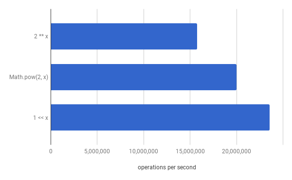

# Rounding Up to the Next Power Of Two

Aug 11th, 2017

Quick one: given a positive number, how to round it up to the next power of two?

This article explores several possibilities to compute it and the algorithmic complexities involved in each of them. It also presents some benchmarks and source code so you can test it yourself. Although examples are all in Javascript, the knowledge discussed here applies to any language, since in the end it all boils down to one thing: algorithm complexity.

## But what's the point?

Why would someone want to find the next power of two? Well, one good example involves efficiency.

Say you're going to implement a circular buffer over a regular Array object. The reader process wants to iterate over buffer entries as fast as possible, non stop. Let's consider, for simplicity's sake, that we don't have to care about concurrency issues for now. This is one possible way to read from the buffer:

    function *nextEntry() {
        let i = 0;
        while (true) {
            yield entries[i];
            i = (i + 1) % BUFFER_SIZE;
        }
    }

    for (const entry of nextEntry()) {
        doSomethingWith(entry);
    }

So, for every entry read, the read index is incremented by one. If it reaches the end of the buffer, the index automatically wraps around because of the modulus operation. But there's a slight different version of that code that performs significantly better.

## Modulus vs. bitwise AND

What if I say the code above can run 5% faster by just replacing a single operator? It turns out that the bitwise AND operator can make that happen. Instead of doing:

    i = (i + 1) % BUFFER_SIZE;

We do:

    i = (i + 1) & BUFFER_MASK;

And that's it. The new variable `BUFFER_MASK` is just `BUFFER_SIZE - 1`; I'm gonna explain this in the next section. If we benchmark it using [Benchmark.js](https://benchmarkjs.com) with Node v8.2.1, this is what we get:

    [ modulus ] x 81,143,766 ops/sec ±1.02% (91 runs sampled)
    [ bitwise ] x 85,500,366 ops/sec ±0.91% (92 runs sampled)

Which means the bitwise version performed 5% better than the modulus one on my Node's V8. So, if you're interested in speed, bitwise is the way to go.

*As a side note, I also tried a third case: testing a condition to see if we got to the end of the array. This is the code:*

    i++;
    if (i === SIZE) {
        i = 0;
    }

*It just performs much worse than the other two, but I decided to put it here just for completeness sake:*

    modulus x 81,141,869 ops/sec ±1.08% (85 runs sampled)
    bitwise x 85,078,250 ops/sec ±0.99% (93 runs sampled)
    condition x 78,730,148 ops/sec ±0.86% (93 runs sampled)

## Power of two comes into play

It so happens that for making the bitwise operator work with our circular buffer, `BUFFER_SIZE` can't be any value anymore; only powers of two will work. As we are and'ing with a MASK to make the index go back to zero at some point, that mask must be all ones. That means it is always a power of two minus 1. So, when allocating our buffer, we have to make its size a power of two.

Many times you will want to receive that size as a parameter, either from the user or from some third-party library, and it's possible that the provided size won't be a power of two. You have two options, then:

1. enforce the value to be a power of two: you could, for instance, receive an exponent instead of the intended size. If, say, you receive `3`, your size will be `2**3`. Another possibility would be to receive the size and throw an exception if its value is not a power of two;

2. adjust your final underlying array size to have at least the size passed as parameter, but so that it is also a power of two.

I prefer the second option, which is a bit friendlier. Just let the caller pass whatever value suits it and internally we'll adjust it to our needs without bothering anyone.

## Ok, I'm listening; show me some code

So, finally back to the original question, we face the challenge of how to find the next power of two after a given value.

One first approach would be to iterate through all powers of two until you find the first one greater than the number being queried for:

    function nextPowerOfTwoLogN(value) {
        let powerOfTwo = 1;
        while (powerOfTwo < value) {
            powerOfTwo <<= 1;
        }
        return powerOfTwo;
    }

How long this code takes to run depends on the input, and that's what's wrong with it. If `value` is 4, it will loop 2 times. If `value` is 4294967296, it will loop 31 times. Ok, it's not that problematic, considering its complexity is growing logarithmically (i.e., `O(log n)`). But there's also a constant time way of doing it:

    function nextPowerOfTwoCeilConstant(value) {
        return 2 ** Math.ceil(Math.log2(value));
    }

Let's compare them in Benchmark.js with `value` set to, say, 5:

    [ log n    ] x 41,657,841 ops/sec ±0.46% (94 runs sampled)
    [ constant ] x 15,991,753 ops/sec ±0.54% (90 runs sampled)

Ouch! The looped approach was 2.6 times faster. But it was favored by the fact that `value` was set to a low number and it only had to iterate twice to find the power of two. Let's increase the power of two by an order of magnitude and see what happens. Say `value` is now `1 << 30`, or 1073741824:

    [ log n    ] x 7,653,783 ops/sec ±0.32% (91 runs sampled)
    [ constant ] x 15,475,871 ops/sec ±0.56% (91 runs sampled)

Now the `O(log n)` approach has to iterate 29 times to find the power of two and it now takes twice the CPU time of the constant time approach. So at some point the constant time approach started winning. Let's plot value for several powers of two and see how they compare:

So it is at around `1 << 12` that the constant time approach starts winning. The chart also proves that `Math.log` takes really constant time to run, i.e., it doesn't depend on the input value.

Of course, if you're only expecting low values (lower than 4096), you should go with the `O(log n)` approach. What is important to see is that, for higher values, constant time will always prevail, no matter which language you use. And, speaking of languages, I wonder if we could make Javascript perform better in the constant time scenario.

## Some Javascript wizardry

Specifically for the Javascript case, let's test some variations of the constant time approach and see how it can be improved. There are some things we can try:

- replacing `2 ** x` with `Math.pow(2, x)`
- replacing `2 ** x` with `1 << x`
- replacing `Math.ceil(x)` with flooring techniques plus some extra operations

### The exponentiation operator

`x ** y` is the ES7 exponentiation operator which is already available on the latest V8. But there's also the old way of doing exponentiation: the `Math.pow()` function. And if the base is 2, you can take a shortcut and use `1 << x` instead. Let's see how they compare in Benchmark.js for an input value of `1 << 30`:

    [ 2 ** x         ] x 15,748,231 ops/sec ±0.39% (92 runs sampled)
    [ Math.pow(2, x) ] x 19,987,919 ops/sec ±0.41% (95 runs sampled)
    [ 1 << x         ] x 23,537,239 ops/sec ±0.44% (93 runs sampled)

The bitwise shift operation is ~1.5 faster than the exponentiation operator, at least for the current V8 version. It's funny to see how they implemented a new way of calculating powers that is slower than the existing `Math.pow()`. Wouldn't it be easier to just map `2 ** x` to `Math.pow(2, x)` internally? Anyway, let's pick `1 << x` and move on.

### The ceiling function

Replacing `2 ** x` with `1 << x` from here on, let's now focus on `Math.ceil()`. Another way of finding the ceiling would be to use `Math.floor()` instead, and then check to see if the original value is greater than the result, when we would then do `floor() + 1` to get the ceiling; if the original value is equal to the result, simply return the result. Here's the complete function:

    function nextPowerOfTwoWithFloor(value) {
        const log2 = Math.log2(value);
        const log2Trunc = Math.floor(log2);
        return 1 << (log2 === log2Trunc ? log2Trunc : log2Trunc + 1);
    }

But before benchmarking it, let's add some variations as well. There are three other ways I know of to calculate the floor in Javascript:

- `Math.trunc(x)`, which for positive values of `x` behaves exactly as `Math.floor(x)`;
- `x >>> 0`, a bitwise hack. Shifting 0 bits to the right is an old trick to get Javascript to convert x to an integer, since all bitwise operations convert operands to 32-bit integer values first. The difference between `>>` and `>>>` is that the latter zero-fills the number while right shifting, effectively converting it to a positive value by removing any fractional digits, i.e., by truncating it;
- `~~x`, another bitwise hack that converts a value to its negated counterpart, and then back to the original value. In the process, though, the value is forced to a 32-bit integer, effectively truncating the original value.

This is the resulting of comparing all five of them in Benchmark.js, ordered by speed, slowest to fastest with an input value of `1 << 30`:

    [ Math.trunc(x) ] x 22,354,086 ops/sec ±0.43% (92 runs sampled)
    [ Math.ceil(x)  ] x 23,510,240 ops/sec ±0.50% (90 runs sampled)
    [ x >>> 0       ] x 24,350,711 ops/sec ±0.39% (96 runs sampled)
    [ Math.floor(x) ] x 24,509,858 ops/sec ±0.34% (95 runs sampled)
    [ ~~x           ] x 24,686,332 ops/sec ±0.43% (96 runs sampled)

Curiously, as long as you don't use `Math.trunc()` or `Math.ceil()`, there isn't much difference between the rest:

Finally, let's see how it compares when projected in that first chart:

With the improvement, it now makes sense to use the constant time approach even for numbers as low as `1 << 8`, i.e., 256.

## Now for some legendary wizardry to blow your mind

This is a very nice bit manipulation hack found on [Bit Twiddling Hacks](https://graphics.stanford.edu/~seander/bithacks.html#RoundUpPowerOf2). It's originally written in C, but it fits nicely in Javascript as well. It also only makes sense for 32 bit values, but that's fine by us since all bitwise operations in Javascript end up by converting our input values to 32 bit integers anyway. So here it is:

    function nextPowerOfTwoBitTwiddling(value) {
        value--;
        value |= value >>> 1;
        value |= value >>> 2;
        value |= value >>> 4;
        value |= value >>> 8;
        value |= value >>> 16;
        value++;
        return value;
    }

Its benchmark is just fantastic (always using an input value of `1 << 30`):

    [ log n         ] x 7,603,760 ops/sec ±0.35% (95 runs sampled)
    [ ~~x           ] x 24,833,968 ops/sec ±0.51% (93 runs sampled)
    [ bit twiddling ] x 65,754,897 ops/sec ±1.09% (91 runs sampled)

It proves to be faster for any input value, so we can just throw the O(log n) approach away! Amazing stuff.

And that closes our experiment. We first saw that `&` is cheaper than `%` and worth using if you're going to repeat it over and over during execution. Then we walked through several variations on how to compute the next power of two of a number and it showed us that constant time approaches will always win in the long run. We then finally saw the hack for 32 bit values that ended any possibility of us still wanting to use the O(log n) approach for lower values.

That's it for now. I intend to write more stuff about practical use of algorithm complexity soon. Feel free to suggest improvements or raise questions about this experiment.

## Small note about jsPerf and Benchmark.js

I planned on using [jsPerf](https://jsperf.com/) for publishing my results, but it turns out it's been so slow recently it turns one angry just trying to access it, let alone publishing results. It uses [Benchmark.js](https://benchmarkjs.com) internally, so I decided to just download it and use it directly.

To download it, if you want to try the source code below yourself:

    cd <source-code-directory>
    npm i benchmark

## Source code

Here's the full source code for the first part, comparing modulus vs. bitwise AND:

    "use strict";

    const Benchmark = require('benchmark');

    const suite = new Benchmark.Suite('Circular Buffer Test');

    let i = 0;
    const SIZE = 1024;
    const SIZE_MASK = SIZE - 1;

    function setup() {
        i = 0;
    }

    suite
        .add('[ modulus   ]', () => i = (i + 1) % SIZE, { onStart: setup })
        .add('[ bitwise   ]', () => i = (i + 1) & SIZE_MASK, { onStart: setup })
        .add('[ condition ]', () => { i++; if (i === SIZE) i = 0; }, { onStart: setup })
        .on('cycle', function (event) {
            console.info(event.target.toString());
        })
        .on('complete', function () {
            console.info('-'.repeat(120));
            console.info('Fastest is ' + this.filter('fastest').map('name'));
        })
        .run({ 'async': true });

And here's the source for the second part, comparing techniques for finding the next power of two:

    "use strict";

    const Benchmark = require('benchmark');
    const suite = new Benchmark.Suite;

    const NUMBER_TO_CHECK = (1 << 30);

    function nextPowerOfTwoLogN(value) {
        let powerOfTwo = 1;
        while (powerOfTwo < value) {
            powerOfTwo <<= 1;
        }
        return powerOfTwo;
    }

    function nextPowerOfTwoCeilConstant(value) {
        return 2 ** Math.ceil(Math.log2(value));
    }

    function nextPowerOfTwoCeilConstantV2(value) {
        return 1 << Math.ceil(Math.log2(value));
    }

    function nextPowerOfTwoCeilConstantV3(value) {
        return Math.pow(2, Math.ceil(Math.log2(value)));
    }

    function nextPowerOfTwoCeilConstantV4(value) {
        const log2 = Math.log2(value);
        const log2Trunc = Math.floor(log2);
        return 1 << (log2 === log2Trunc ? log2Trunc : log2Trunc + 1);
    }

    function nextPowerOfTwoCeilConstantV5(value) {
        const log2 = Math.log2(value);
        const log2Trunc = Math.trunc(log2);
        return 1 << (log2 === log2Trunc ? log2Trunc : log2Trunc + 1);
    }

    function nextPowerOfTwoCeilConstantV6(value) {
        const log2 = Math.log2(value);
        const log2Trunc = log2 >>> 0;
        return 1 << (log2 === log2Trunc ? log2Trunc : log2Trunc + 1);
    }

    function nextPowerOfTwoCeilConstantV7(value) {
        const log2 = Math.log2(value);
        const log2Trunc = ~~log2;
        return 1 << (log2 === log2Trunc ? log2Trunc : log2Trunc + 1);
    }

    function nextPowerOfTwoBitTwiddling(value) {
        value--;
        value |= value >>> 1;
        value |= value >>> 2;
        value |= value >>> 4;
        value |= value >>> 8;
        value |= value >>> 16;
        value++;
        return value;
    }

    suite
        .add('[ log n         ]', nextPowerOfTwoLogN.bind(null, NUMBER_TO_CHECK))
        .add('[ constant      ]', nextPowerOfTwoCeilConstant.bind(null, NUMBER_TO_CHECK))
        .add('[ Math.pow(2,x) ]', nextPowerOfTwoCeilConstantV3.bind(null, NUMBER_TO_CHECK))
        .add('[ Math.ceil(x)  ]', nextPowerOfTwoCeilConstantV2.bind(null, NUMBER_TO_CHECK))
        .add('[ Math.floor(x) ]', nextPowerOfTwoCeilConstantV4.bind(null, NUMBER_TO_CHECK))
        .add('[ Math.trunc(x) ]', nextPowerOfTwoCeilConstantV5.bind(null, NUMBER_TO_CHECK))
        .add('[ x >>> 0       ]', nextPowerOfTwoCeilConstantV6.bind(null, NUMBER_TO_CHECK))
        .add('[ ~~x           ]', nextPowerOfTwoCeilConstantV7.bind(null, NUMBER_TO_CHECK))
        .add('[ bit twiddling ]', nextPowerOfTwoBitTwiddling.bind(null, NUMBER_TO_CHECK))
        .on('cycle', function(event) {
            console.info(String(event.target));
        })
        .on('complete', function() {
            console.info('-'.repeat(120));
            console.info('Fastest is ' + this.filter('fastest').map('name'));
        })
        .run({ 'async': true });
