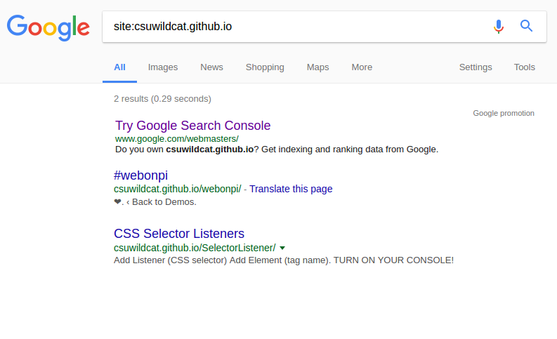
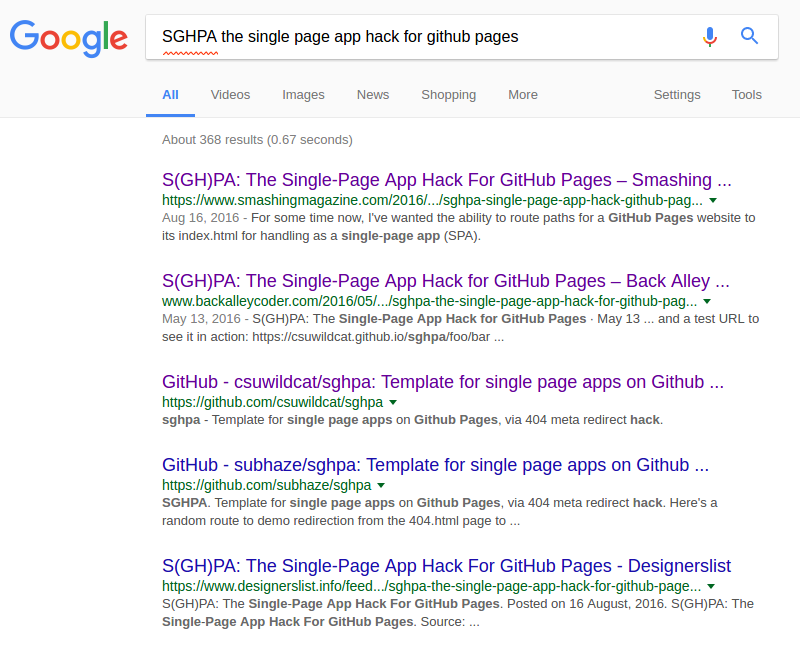
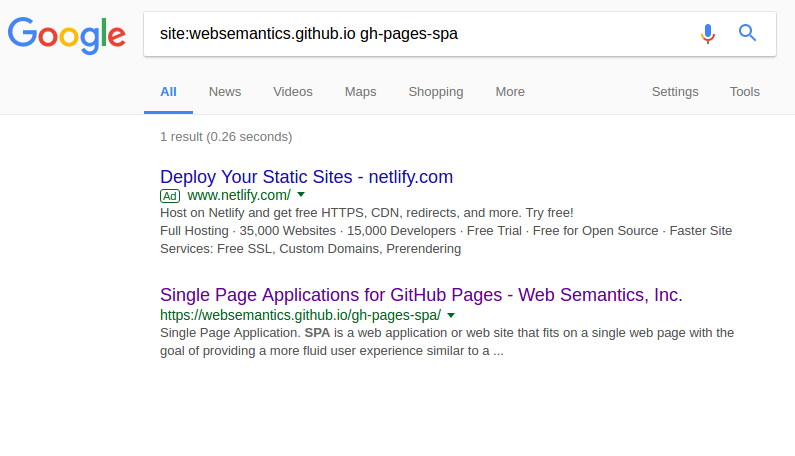

# The Beauty Behind These Pages

June 18th, 2017

In this article I explain how I made my personal home page using vanilla Javascript and GitHub Pages.

## Where to host it

 There's a handful of possibilities out there if you want to make your own static home page. First, you don't want expensive hosting services, since all you need is some basic server to provide browsers with your static content, no extra server-side work required. You could use AWS S3 for that, or you could just use **GitHub Pages** and even version your page at the same time... and that's what I chose.

## Static site generators?

There's this project called Jekyll. It parses your raw article texts and spits out static pages ready to be published. GitHub supports it and I have a close friend who is [using it in his blog][bernardo]. Should you use it? Well, it so happens that I am averse to having to compile, build or do any kind of post-processing to my Javascript code. I avoid this building step as much as possible. Of course, if it makes your life easier, you should use. But what I like the most in a scripting language is the possibility of just hitting the "play" button and watch it live, no bureaucracy involved. That's why I never really liked Grunt or Gulp, and why I decided to give up on Typescript in favor of pure ES6. So, no, **I won't use Jekyll or any kind of site generators** for that matter.

Not this time, Dr. Jekyll!

## Keep it simple and modern

And that's also why I decided to go vanilla with my page as much as I can. The beauty comes with simplicity. I want to write HTML, CSS and Javascript and see it working right off the bat. I also want to breathe 21st century Javascript, so **ES6** for the win... and I don't mind if it doesn't work in Microsoft's browsers; I instead prefer my code to look beautiful.

## Which libraries to use?

For page styling, of course, **Bootstrap**. It makes your page beautiful and it gives you license to stick your layout inside your HTML again, guilty-free (yes, to me these grid systems are nothing but a license to rape tableless design and go back to the 90's... but that's fine by me; they work pretty well and the job gets done quickly).

A couple of years ago, the next thing I would mention would be jQuery. To me, jQuery saved the web and prevented the death of thousands of web developers who would most certainly end their lives otherwise, given the mess the web was before John Resig came to free us all from Microsoft's evil plan to destroy the world with a mass-destruction weapon named IE. But now the future has arrived, at last. ES6 is here, Microsoft lost its market share and jQuery is not needed anymore. That's OK if you want to use it, though. I can understand. It's magical. But believe me, you don't need it anymore. So long, John, and thanks for all the fish. We love you.

There is a new guy in town, though. His name's Mike Bostock and he came up with an awesome toolkit called D3. I expect to use it extensively in my articles since I love data visualization, so I'll keep it around from the beginning. If you still haven't heard of it, stop everything you are doing and [go take a look][d3].

## Markdown articles

The most important thing here however is content. I need to have something interesting to show in my page. I want to write articles like this one and I want it to be pain-free, so I can focus on what I have to say instead of wasting my time finding out why my build system broke after I updated `npm` to the next version. Someone who likes Jekyll could tell you: "see, that's the good thing about it, you can write your articles in Markdown and your articles will shine in all their glory". Well, I say forget Jekyll. Let's come up with our own, simpler way to write in Markdown and still make it work without the need for a build system.

And here comes [marked][marked] to the rescue. It does on-the-fly Markdown parsing on the client side; so no need to pre-process anything. You can happily write your article and then call marked to parse it for you. Heck, you can even write it in a separate file and make Javascript load it for you inside your HTML:

    window.addEventListener('load', () => {
        d3.text('index.md', (error, data) => {
            const element = document.getElementById('contents');
            element.innerHTML = marked(data);
        });
    });

The code first waits for the `load` event to be triggered, meaning the page has finished loading. When that happens, it asks `d3` to load our Markdown file as plain text, which then gets passed to `marked` so it can turn the article into proper HTML and stuff it into a `div` element we have just for that.

As of the time of this writing, marked seems to be in limbo. His author is not maintaining it anymore and, although it granted commit access to some people in the community, it still has tons of pull requests to be reviewed and people are starting to talk about a fork of the project under a new name. For now, however, marked is still the best way to go, it seems. I can say it's working pretty well for me.

Marked parses code blocks as plain text. If you want syntax highlighting, though, it exposes a callback where you can plug your favorite highlighting tool. I'm using Highlight.js here. It allows you to select among several available styles and it even lets you pick which languages you want to support, contributing to let your final page size as small as possible. Here's how I'm using it:

    marked.setOptions({
        highlight: code => hljs.highlightAuto(code).value
    });

`hljs` is the global exported by Highlight.js. What you have to do is register a callback for when Marked detects code which could undergo syntax highlighting. Although it works pretty well, there's one glitch I had to fix regarding `pre` elements' background color. As Marked handles only `pre` elements' contents to the highlighter, the highlighter is not able to modify `pre`s' attributes themselves. This means Highlight.js can't add `hljs` class to `pre` elements and its CSS script is then not able to properly add a background color to them. To fix this, I had to write the following patch inside my Javascript file, right after Marked ran:

    // marked does not let Hightlight.js add `hljs` class to pre elements as it should
    for (const pre of element.querySelectorAll('pre')) {
        pre.classList.add('hljs');
    }

With that, my basic script is able to load, parse and do syntax highlighting to all my articles from now on and I don't have to worry about any of that anymore. Cool!

## Site structure and SEO

I'm a big fan of SPA. It makes total sense for the browser to process things instead of letting the server do it. Why do I need to keep asking the server for more HTML every time the user clicks on a link when I could've loaded it all at once, as my operating system would do when it loads an application? It makes even more sense over the internet, since each request means potentially traversing the whole world twice so the response can get to your computer. Let alone the fact that if you're requesting pure data (via AJAX calls), it means your server code is probably much better organized, since your endpoints don't have to bother sending both structure and content at the same time.

On the other hand, when it comes to SEO, there's still a lot of uncertainty on the web regarding SPA. There's [this post][search-engine-land-article] from Search Engine Land saying Googlebot is very smart because not only it can parse Javascript, it also does a lot of tricks you wouldn't think of. But you'd have to trust what they are saying, because there's no proof and no description on how to reproduce their tests. There are several blog posts pointing to their article, but everybody is just believing what the article says without further testing it.

The reason I am trying to find out whether their article is really telling the truth is because I wanted to try [a trick this guy discovered][daniel-buchner-article] to have a SPA application with real path routing working. The trick works pretty well, it seems, but how do web crawlers see it? *TL;DR: the tricks works by redirecting `404.html` GitHub pages back to your single-page application.* The problem is, although it works seamlessly from a user standpoint, how does it work with respect to SEO? The author points to Search Engine Land's article, saying they found out 301 redirects are transparently handled by Googlebot. Is this true? They don't specifically mention 301s coming from 404s. Well, the example the author posted seems to not have been correctly crawled by Google. I just can't find anything about it when searching Google:

I would expect to find `https://csuwildcat.github.io/sghpa/foo/bar` in Google's results, since this link can be crawled from the author's article page *and the article was crawled by Google*:

There are in fact at least 4 crawled links to it. The original author's post, a repost made by Smashing Magazine, the author's GitHub project page and a fork someone did of it. But still no trace of `/foo/bar`, the one link that must go through a 404 to be indexed. Notice there's also no mention to `https://csuwildcat.github.io/sghpa/` in Google's results. One would find it strange, since one can access it via a HTTP 200 just fine. The explanation here is that there is nobody linking to it. The only existing links go directly to `/foo/bar`, which isn't being crawled, it seems.

I also found [this project][pikachu] which wraps the 404 trick into a library. Interestingly enough, however, it also didn't get crawled by Google!

The main page is there (the one link you access via a 200), but see that `/about` and `/contact` do not figure in the search, both accessed only via a 404. So I strongly advise against using the 404 trick, unless you don't care about SEO. This issue seems to interesting I think I'm gonna write a separate article about it at some point.

Because of that, **it seems that the only good way to have your routes nicely crawled by Google in a GitHub page is to just have real files after each path you want crawled**.

So I ended up having an HTML file for each article I write, each in its own folder:

    /
        articles/
            my-first-article/
                index.html
                index.md
            my-second-article/
                index.html
                index.md

This allows me to have the following paths:

    /articles/my-first-article
    /articles/my-second-article

And then we can be pretty sure they will be perfectly crawled by bots with nice and clean URLs (no trailing `.html`).

The drawback here is the boilerplate in `index.html`. It is almost the same for all articles, except for the title and meta description tags. We can get around this, though. My idea is to extract the title and the description straight from the Markdown article itself. Here's what we'll do:

    element.innerHTML = marked(data);

    // extracts the first H1 as the page title and the first phrase as the page description
    const pageTitle = element.querySelector('h1').innerText;
    const descriptionResult = element.querySelector('p').innerText.match(/[^.]+/) || [''];

    document.title = pageTitle;
    document.querySelector('meta[name="description"]').setAttribute('content', descriptionResult[0]);

We parse the Markdown file just like before, but after that we query it for the first `H1` tag that appears, which will be interpreted as our article title. We also query for the first paragraph and extract the first phrase from it. This will be used for the page's description tag, so it can be properly crawled by Googlebot. This will also force me to put a very descriptive phrase at the very beginning of every article.

So now I can have a template index.html ready to be copied every time I write a new article. I just have to copy it from any other existing article and paste it into the new article's folder. My Markdown files are all going to be called `index.md` so `index.html` will automatically find it for every new article. Simple and easy, right?

And that's about it. Now you just have to publish it to GitHub and see your page go live, no pain involved. This ends my first article, which I hope will be of use to someone else. Please feel free to contact me if you see this article can be improved somehow. A good way would be to [open an issue in GitHub][github-issue]. Stay tuned for the next article :-)

[bernardo]: http://www.bernardopacheco.net
[marked]: https://github.com/chjj/marked
[d3]: https://d3js.org
[search-engine-land-article]: http://searchengineland.com/tested-googlebot-crawls-javascript-heres-learned-220157
[daniel-buchner-article]: http://www.backalleycoder.com/2016/05/13/sghpa-the-single-page-app-hack-for-github-pages
[pikachu]: https://websemantics.github.io/gh-pages-spa
[github-issue]: https://github.com/luciopaiva/luciopaiva.github.io/issues
