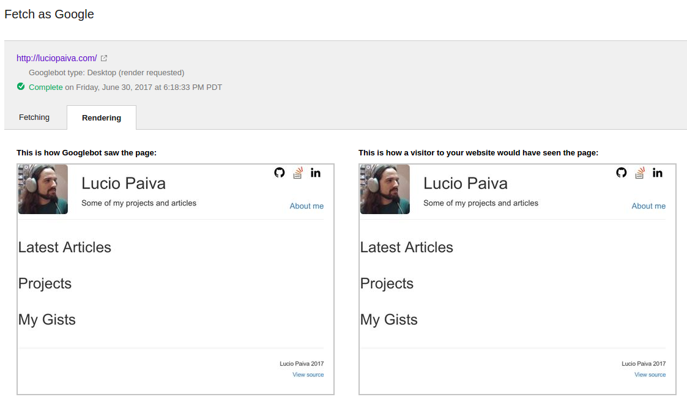
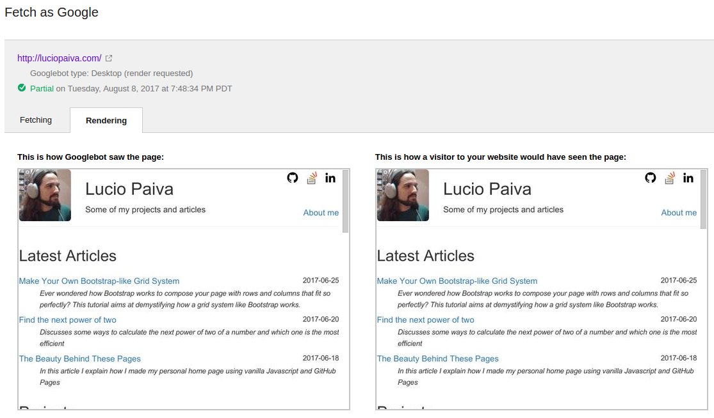
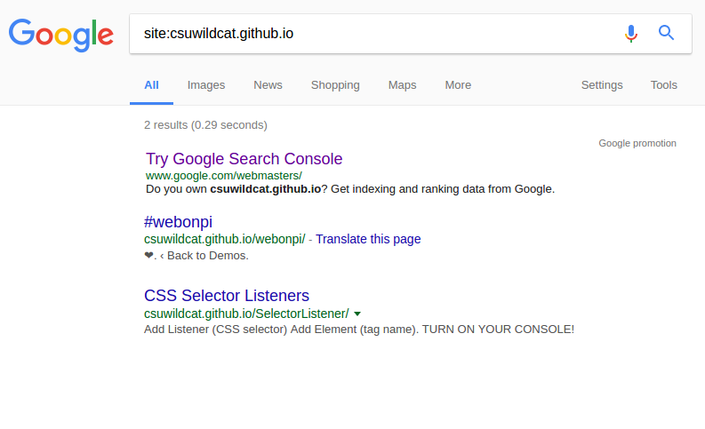
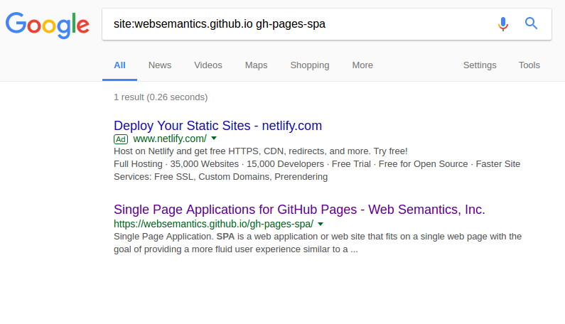

# How to Make your Own Blog, Javascript Style

Aug 11th, 2017

In this article I give it a shot at how to make an SEO-aware, Markdown-driven personal blog using nothing more than a static web server and a little bit of Javascript.

## The goal

My goal from the beginning was to have some quick platform I could just write stuff and publish it online, no strings attached. I just want to sit, concentrate, write Markdown, commit, push it to the could and watch it go live automatically. And that's what I'm going to show you how to do in my debut article.

## Where to host it

Since my idea doesn't require any server side logic, this part is easy. There's a handful of possibilities out there if you want to make your own static home page. First, I'm not interested in expensive hosting services, since all I need is some basic server to provide visitors' browsers with my static content, no extra server-side work required. I could use AWS S3 for that, or I could just use **GitHub Pages** and even host my page repository at the same time, let alone I can share my code with everyone else... so GitHub FTW.

## Static site generators?

There's this project called [Jekyll][jekyll]. It parses your raw articles' texts and spits out static pages ready to be published. I have a close friend who is [using it in his blog][bernardo]. Should I use it? Well, since my main objective is to keep the process of writing new articles as simple as possible, I decided not to use it; at least not for now. Not any kind of static site generators, for that matter. So how on earth will we be able to write Markdown and get HTML in the end?

## Just-in-time Markdown parsers

The world of Javascript is awesome and for every task someone probably already came up with a tool for it. That's exactly the case if you want to render Markdown on the client side. Although I want to avoid any building steps, I still have to find a way to process my Markdown text at some point. That's why I am going to rely on a *client-side Markdown parser*. The browser will download my Markdown file, process it and render HTML as output. How?

Enter [marked][marked]. It does on-the-fly Markdown parsing on the client side; no need to pre-process anything. You can happily write your article and then call marked to parse it for you when it's time to show it. Heck, you can even write it in a separate file and have Javascript load it and inject it into your HTML in just 3 easy steps:

1. download it using Ajax (`XMLHttpRequest`)
2. feed it to Marked and collect the resulting HTML
3. inject the HTML into some element's `innerHtml` property

And that's basically it. Or is it?

## Syntax highlighting

Well, since this is mostly a programming web site, we may also want to parse and highlight code blocks. Marked parses code blocks as plain text by default. If you want syntax highlighting, though, it exposes a callback where you can plug any third-party syntax-highlighting library. I'm going to use [Highlight.js][highlightjs] here. It allows you to select among several available styles and it even lets you pick which languages you want to support, contributing to let your final page size as small as possible. Plugging it into Marked is easy:

    marked.setOptions({
        highlight: code => hljs.highlightAuto(code).value
    });

`hljs` is the global variable exported by Highlight.js. What you have to do is register a callback for when Marked detects code which could undergo syntax highlighting. Although it works pretty well, there's one glitch I had to fix regarding `pre` elements' background color. As Marked hands only the *contents* of `pre` tags to the highlighter, the highlighter is not able to modify `pre` tags' *attributes*. This means Highlight.js can't add `hljs` class to `pre` elements and its CSS script is then not able to properly add a background color to them. To fix this, I had to write the following patch inside my Javascript file, right after Marked executed:

    // marked does not let Hightlight.js add `hljs` class to pre elements as it should
    contentsElement.querySelectorAll('pre code').forEach(function (pre) {
        pre.classList.add('hljs');
    });

With that patch, my basic script is now able to load, parse and do syntax highlighting to all my articles from now on and I don't have to worry about any of that anymore. Cool!

*Note: as of the time of this writing, marked seems to be in limbo. His author is not maintaining it anymore and, although it granted commit access to some people in the community, it still has tons of pull requests to be reviewed and people are starting to talk about a fork of the project under a new name. For now, however, marked is still the best way to go, it seems. I can say it's working well enough for me.*

## Less than 100 LoC

See my full Javascript solution for loading articles here: http://luciopaiva.com/articles/article.js. It's less than 100 lines of code and it doesn't require jQuery nor YourFavoriteFramework.js; just plain *old* Javascript. Old? Yes :-( Unfortunately, I can't use any ES6 yet. But why?!

## Googlebot, Javascript and SEO

My initial intention was to go full ES6 with my web site. We're past the dark ages of Javascript where Microsoft's Internet Explorer dominated the browser market share across the world. Fortunately, nowadays this is no longer a problem. So I could just use all cool features and not worry about any clunky, stupid browser that doesn't follow standards. But I still can't. Blame Googlebot!

No matter how awesome your page is, people still have to know somehow about its existence. It needs to be crawled; even better: it needs to be *crawlable*. That's where the problem lives. At first I was fooled by articles like [this][search-engine-land-article] that guarantee Googlebot crawls Javascript. It means that if your content is loaded via some Javascript, you should not worry: Googlebot will parse it before indexing your site. But that's not entirely true, as I'm gonna show you next.

Originally, my `articles.js` script was pure ES6. See it [here](https://github.com/luciopaiva/luciopaiva.github.io/blob/3040fac13655d00466181b684c82d59bb59af661/articles/article.js). `class`, `async/await`, `Promise`, lambda functions... you name it. I put it online, [asked Google to crawl it](https://support.google.com/webmasters/answer/6066468?hl=en), but the content simply did not show up:

I left it online for a few weeks, waiting to see what would happen. Maybe *Fetch as Google* was not parsing Javascript, but Googlebot would? After a couple of days, I tried googling "site:luciopaiva.com about" and it was there, but the search result showed the page title as a test string I left there, which would be replaced only if Googlebot was able to run my Javascript - which it obviously didn't.

So I started cursing all those people that said "of course Googlebot parses Javascript! It's 2017!". It looked like my idea started to go down the drain. Were they all wrong?

Since so many people (including Google) says Googlebot does parse Javascript, I decided to try an hypothesis: could it be something particular about my Javascript?

## What they didn't tell you about crawling Javascript

After googling a bit, I stumbled upon this [PhantomJS feature request for supporting ES6](https://github.com/ariya/phantomjs/issues/14506), which made me think: "hmm, I wonder if Googlebot uses Phantom.js"... It then occurred to me that the problem could be that my Javascript was too hip for Googlebot. Maybe Googlebot didn't support ES6 yet? That's a reasonable guess, so I decided to downgrade my Javascript to ES5 in the hopes that I would at least learn something in the process. And I couldn't be happier with the result:

So that was it. People were not lying after all, but they didn't know of this nasty detail: do not use ES6 yet if you want to be crawlable.

*On a side note, I was also concerned if Googlebot would run AJAX, but it ended up running it. I also found [this excellent article][does-google-execute-javascript] in which the author finds the same results as I (as of 2017), so I guess we can confirm that information.*

## SPA routes: fail

I also wanted to try [a trick this guy discovered][daniel-buchner-article] to have a SPA application with real path routing working. The trick works pretty well, it seems, but how do web crawlers see it? *TL;DR: the tricks works by redirecting `404.html` GitHub pages back to your single-page application.* The problem is, although it works seamlessly from a user standpoint, how does it work with respect to SEO? The author points to Search Engine Land's article, saying they found out 301 redirects are transparently handled by Googlebot. Is this true? They don't specifically mention 301s that come from 404s. Well, the example the author posted seems to not have been correctly crawled by Google. I just can't find anything about it when searching on Google:

I would expect to find `https://csuwildcat.github.io/sghpa/foo/bar` in Google's results, since this link can be crawled from the author's main article page *and the main page was crawled by Google*:

There are in fact at least 4 crawled links to it. The original author's post, a repost made by Smashing Magazine, the author's GitHub project page and a fork someone did of it. But still no trace of `/foo/bar`, the one link that must go through a 404 to be indexed. Notice there's also no mention to `https://csuwildcat.github.io/sghpa/` in Google's results. One would find it strange, since it can be accessible via a HTTP 200 just fine. The explanation here is that there is nobody linking to it. The only existing links go directly to `/foo/bar`, which isn't being crawled, it seems.

I also found [this project][pikachu] which wraps the 404 trick into a library. Interestingly enough, it also didn't get crawled by Google!

The main page is there (the one link you access via a 200), but see that `/about` and `/contact` do not figure in the search, both being accessible only via a 404. So I strongly advise against using the 404 trick, unless you don't care about SEO.

Because of that, the conclusion is that **the only good way to have your routes nicely crawled by Google in a GitHub page is to just have real files after each path you want crawled**.

## My final blog file structure

So I ended up having an HTML file for each article I write, each in its own folder:

    /
        articles/
            my-first-article/
                index.html
                index.md
            my-second-article/
                index.html
                index.md

This allows me to have the following paths:

    /articles/my-first-article
    /articles/my-second-article

And then we can be pretty sure they will be perfectly crawled by bots with nice and clean URLs (no trailing `.html`).

## Getting rid of some boilerplate code

A minor drawback here is the boilerplate in `index.html`. It is almost the same for all articles, except for the title and meta description tags. We can get around this, though. My idea is to extract the title and the description straight from the Markdown article itself. Here's what we'll do:

    element.innerHTML = marked(data);

    // extracts the first H1 as the page title and the first phrase as the page description
    const pageTitle = element.querySelector('h1').innerText;
    const descriptionResult = element.querySelector('p').innerText.match(/[^.]+/) || [''];

    document.title = pageTitle;
    document.querySelector('meta[name="description"]').setAttribute('content', descriptionResult[0]);

We continue parsing the Markdown file just like before, but after that we look for the first `H1` tag occurrence, which will be elected as our page title. We also look for the first paragraph and extract the first phrase from it. This will be used for the page's description tag, so it can be properly crawled by Googlebot. This will also force me to put a very descriptive phrase at the very beginning of every article, which is a good practice per se. And, as [that article][search-engine-land-article] mentioned, Javascript-powered meta tags are handled just fine by Googlebot.

So now I can have a template index.html ready to be copied every time I write a new article. I just have to copy it from any other existing article and paste it into the new article's folder. My Markdown files are all going to be called `index.md` so `index.html` will automatically find it for every new article. Simple and easy, right?

## Pushing it live

And that's about it. Now one just have to push everything to GitHub to see the website go live, no pain involved. There's a few more things to talk about, like blog comment services (e.g., Disqus), but I guess I'll leave that for another time.

This ends my first article, which I hope will be of use to someone else. Please feel free to contact me if you see this article can be improved somehow. An interesting way to contribute would be to [open an issue in GitHub][github-issue]... and that's another cool reason for hosting your blog on GitHub :-)

[jekyll]: https://jekyllrb.com/
[bernardo]: http://www.bernardopacheco.net
[marked]: https://github.com/chjj/marked
[highlightjs]: https://highlightjs.org/
[d3]: https://d3js.org
[search-engine-land-article]: http://searchengineland.com/tested-googlebot-crawls-javascript-heres-learned-220157
[daniel-buchner-article]: http://www.backalleycoder.com/2016/05/13/sghpa-the-single-page-app-hack-for-github-pages
[pikachu]: https://websemantics.github.io/gh-pages-spa
[github-issue]: https://github.com/luciopaiva/luciopaiva.github.io/issues
[does-google-execute-javascript]: https://www.stephanboyer.com/post/122/does-google-execute-javascript
